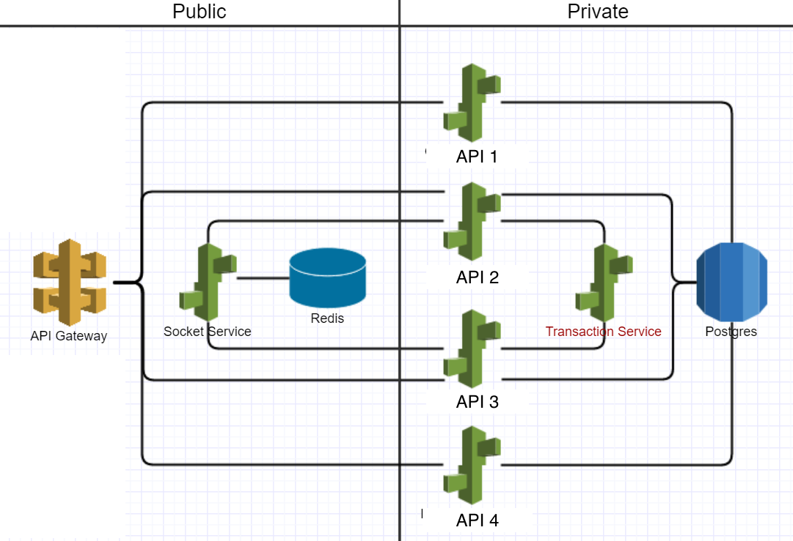

# Doshii Questionnaire

1. Given the below infrastructure image, in your opinion, what improvements could be made? What could be considered a security or performance risk?

2. In a hypothetical situation, AWS costs have been rising month to month by over 30%. What would you do to stem the rising costs?

3. What would you consider to be the pros and cons of outsourcing software development? What about DevOps?
